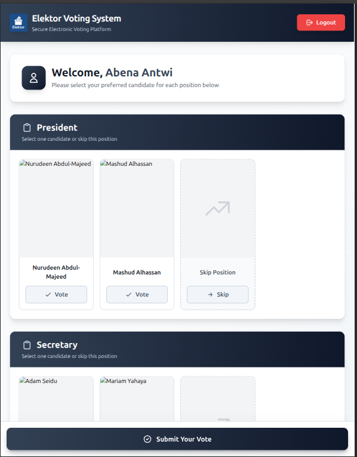

# 🗳️ Elektor – Digital Voting System

**Elektor** is a secure and efficient **web-based voting system** built using the **Express.js**, **PostgreSQL**, **EJS**, and **TailwindCSS** stack.  
It enables administrators to manage elections digitally — adding voters, candidates, and admins — while allowing voters to cast their votes in real-time with live result updates powered by **Socket.IO**.

---

## 📚 Table of Contents
- [Features](#-features)
- [Tech Stack](#-tech-stack)
- [Architecture Overview](#-architecture-overview)
- [Screenshots](#-screenshots)
- [Getting Started](#-getting-started)
- [Environment Variables](#-environment-variables)
- [Usage](#-usage)
- [Project Scripts](#-project-scripts)
- [Deployment](#-deployment)
- [Contributing](#-contributing)
- [License](#-license)

---

## ✨ Features

### 🔐 Authentication & Access Control
- Admins and Super Admins use credential-based login (via **Passport.js**).
- **Super Admins** can:
  - Add voters (manually or in bulk via Excel).
  - Add other admins and candidates.
- **Admins** can:
  - Approve or reject voters.
  - Monitor user and voting activities.

### 🧾 Voter Management
- Voters are imported in bulk from Excel files.
- Unapproved voters cannot access the voting portal.
- Unauthorized login attempts or invalid voter IDs trigger alarms and alerts to notify officials.

### 🗳️ Voting Portal
- Approved voters can log in using only their **Voter ID**.
- Voters can:
  - Cast votes for their preferred candidates.
  - Skip portfolios they don’t wish to vote for.
- After voting, voters are automatically logged out and prevented from re-entering.

### 📊 Real-time Results
- Results are **publicly accessible** (no authentication required).
- Uses **Socket.IO** for **live vote count updates** and dynamic charts/statistics.

### 🧭 Admin Dashboard
- Displays list of voters, candidates, and admins.
- Shows approval and voting statuses for each voter.
- Includes **search functionality** for voter name or ID.

---

## 🛠️ Tech Stack

| Layer | Technology |
|-------|-------------|
| **Frontend** | EJS, TailwindCSS |
| **Backend** | Express.js |
| **Database** | PostgreSQL |
| **Authentication** | Passport.js |
| **Real-time Updates** | Socket.IO |
| **Session Storage** | Express Session | You can configure to use Redis session
| **File Handling** | Multer, XLSX |
| **Deployment** | Render |

---

## 🏗️ Architecture Overview

Client (EJS + Tailwind)
↓
Express.js Server (REST + Socket.IO)
↓
PostgreSQL Database (pg + Redis Adapter)

---

## 🖼️ Screenshots

| Section | Image |
|----------|--------|
| Home |  |
| Admin Dashboard |  |
| Voting Portal |  |
| Results Page |  |

---

## 🚀 Getting Started

### Prerequisites
- **Node.js** >= 18  
- **PostgreSQL** >= 14  

### Installation

```bash
# Clone the repository
git clone git@github.com:nuru484/elektor.git
cd elektor

# Install dependencies
npm install

# Setup database
npm run db:setup

# (Optional) Bootstrap full setup in production
npm run bootstrap
Running the Application
bash
Copy code
# Development mode
npm run dev

# Production mode
npm start
App runs by default at:
👉 http://localhost:8080

🔐 Environment Variables
Create a .env file in the root directory with the variables in .env.example file

⚙️ Project Scripts
Script	Description
npm run dev	Run app in watch mode (development)
npm start	Run production server
npm run bootstrap	Install dependencies and initialize database for production deployment
npm run db:setup	Creates database tables and  structure via db/initialise.js

```

### 🌐 Deployment
Live Demo: https://elektor.onrender.com

Deployed via Render with a connected PostgreSQL instance.

### 🤝 Contributing
- Contributions, issues, and feature requests are welcome!
- Please open a pull request.

### 🧾 License
- This project is licensed under the MIT License.
- © 2025 Nurudeen Abdul-Majeed

### 🧠 Author
- Author: Nurudeen Abdul-Majeed
- Email: abdulmajeednurudeen47@gmail.com